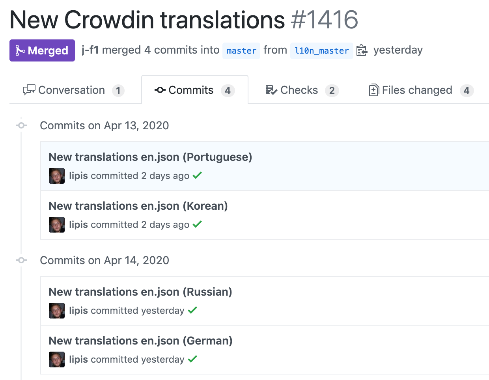

From the early days people asked for [Excalidraw](https://excalidraw.com) to be translated to other languages. Translation infrastructure and community maintenance have historically been a pain to maintain. Thankfully, with projects like [Crowdin](https://crowdin.com) and [i18next-browser-languagedetector](https://github.com/i18next/i18next-browser-languageDetector), Excalidraw is now translated in 20 languages and the whole process has been very low maintenance.

<!-- end -->

## Technical Infrastructure

The first thing we need to do is to update all our literal strings that need to be translated to be using translated strings from a dictionary.

```js
import { t } from "../i18n";

<span>{t("labels.paste")}</span>;
```

The translated strings are stored as JSON in a file per language like this.

```js
// en.json
{
  "labels": {
    "paste": "Paste",
    "selectAll": "Select all",
    "copy": "Copy",
    "copyAsPng": "Copy to clipboard as PNG",
    // ...
  }
}
```

We started using a fully fledged internalization library but unfortunately it was a massive dependency and caused multiple React re-renders on startup and added one long round-trip. So instead [we rolled our own](https://github.com/excalidraw/excalidraw/blob/0ffbde77ac3c10b04b05328a793e753ed33ed736/src/i18n.ts) in less than 100 lines of code.

Since we don't have that many strings, we decided to bundle all the languages by default to avoid an expensive roundtrip during startup if you're not using English. For this we use `require`.

```js
export const languages = [
  { lng: "en", label: "English", data: require("./locales/en.json") },
  { lng: "bg-BG", label: "Български", data: require("./locales/bg-BG.json") },
  { lng: "de-DE", label: "Deutsch", data: require("./locales/de-DE.json") },
  // ...
];
```

The `t` function is pretty simple, where it splits the path by `.` and looks up both the current and fallback languages.

```ts
// t("labels.paste")
//   + current  {"labels": {"paste": "Coller"}}
//   + fallback {"labels": {"paste": "Paste"}}
// -> "Coller"
export function t(path: string, replacement?: { [key: string]: string }) {
  const parts = path.split(".");
  return (
    findPartsForData(currentLanguage.data, parts) ||
    findPartsForData(fallbackLanguage.data, parts)
  );
}
```

The only external library we're using is [i18next-browser-languagedetector](https://github.com/i18next/i18next-browser-languageDetector) which has a lot of great heuristics to figure out what language the user is currently using.

Finally the last piece of the puzzle is to be able to change the language. We opted for a simple `<select>` element.


## Enter Crowdin

At that point, if you wanted to contribute, you need to edit one of those JSON files on GitHub and send a pull request. While this process works, it was tedious to manage. We started adopting [Crowdin](https://crowdin.com) which dramatically improved the whole process.

The initial setup was easy, you create a new project on Crowdin, upload your `en.json` file and connect a GitHub account. Then, any time a translation is added, a pull request is created/updated with the JSON files being modified.

[](https://github.com/excalidraw/excalidraw/pull/1416/commits)

The first cool feature enabled by Crowdin is a language completion illustration. It lets you see at a quick glance what's the current translation status for all the strings. This is also a great motivator for people to translate the languages they speak!

[](https://crowdin.com/project/excalidraw)

Where Crowdin really excels is in the translator experience. For every string, it offers many translation suggestions. In practice the workflow is to chose a string to translate, scroll through the suggestions and click on one that works and repeat. Crowdin also has cool features like capitalization warnings.


Finally, when a new string is added to the default language, all the language contributors receive a notification saying that new strings are available for translation. This helps keep the entire application properly translated!
