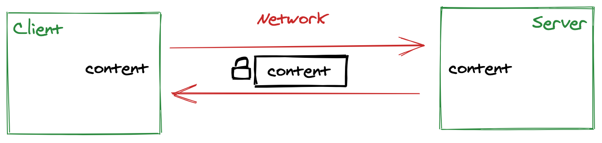
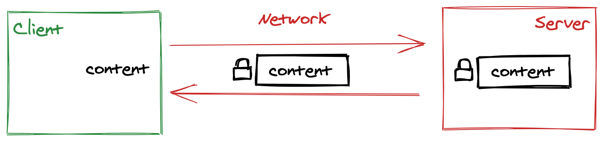
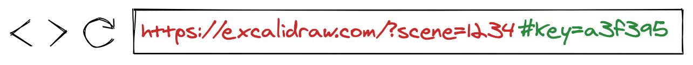

[Excalidraw](https://excalidraw.com/) is a whiteboard tool that lets you easily sketch diagrams that have a hand-drawn feel to them. It is very handy to dump your thoughts many of which are sensitive: designs for new features not yet released, interview questions, org charts...

<!-- end -->

By default, **Excalidraw** doesn’t send anything you draw to the server. But sometimes it is useful to be able to send a link to the scene you are working on to someone else.

You could save the drawing to a file, send it to the other person, and have them open it. But that's pretty cumbersome. In this post we'll show how it’s possible to share just a link without the server having access to the data.

## Traditional Website Architecture

In a traditional website architecture, you’d save a scene by sending it to the server, which gives you a shareable URL. The recipient then downloads the scene data from the server.

In that world, you trust the server to contain your information but you don't have to trust the pipes in between the client and the server, because you use HTTPS to encrypt the data.

[](https://excalidraw.com/#json=5649116445016064,yOfExolZoMhtGnysT3-LWA)

This works well unless the server gets compromised. The attacker will have access to every single drawing ever made! This is something we'd like to avoid.

## End-to-End Encryption

WhatsApp popularized end-to-end encryption, a technique that allows various clients to communicate without the server being able to read the content of the communication.

The idea is to encrypt the content before sending it to the server. The server would just store the encrypted blob and send it back to the client.

[](https://excalidraw.com/#json=5645858175451136,8w-G0ZXiOfRYAn7VWpANxw)

The biggest challenge with this architecture is how to distribute the key to encrypt the message in such a way that the server cannot see it.

Thankfully, in the context of a website, we can exploit the hash part of the URL. Anything that's added after the `#` doesn't get sent to the server, but is readable from the client-side JavaScript code.

[](https://excalidraw.com/#json=5660568841093120,vki3y9xuEulFVHDqt-PBMw)

## Show me the code

Fortunately, the Web Cryptography APIs are now widely available to all the browsers that let us implement this. That said, the APIs to deal with encryption, keys and binary data are not the most straightforward, this next section walks you through how to wire it all together.

### Upload

We generate a random key that will be used to encrypt the data.

```javascript
const key = await window.crypto.subtle.generateKey(
  { name: "AES-GCM", length: 128 },
  true, // extractable
  ["encrypt", "decrypt"]
);
```

We encrypt the content with that random key. In this case, we only encrypt the content once with the random key so we don't need an `iv` and can leave it filled with 0 ([I hope...](https://www.youtube.com/watch?v=LP1t_pzxKyE)).

```javascript
const encrypted = await window.crypto.subtle.encrypt(
  { name: "AES-GCM", iv: new Uint8Array(12) /* don't reuse key! */ },
  key,
  new TextEncoder().encode(JSON.stringify(content))
);
```

We upload the encrypted content to the server. Note that we don't send the key to the server!

```javascript
const response = await (
  await fetch("/upload", {
    method: "POST",
    body: encrypted,
  })
).json();
```

We generate the shareable URL. We use the `jwk` encoding in order to extract a base64 version of the key instead of having a binary encoded one.

```javascript
const objectURL = response.url;
const objectKey = (await window.crypto.subtle.exportKey("jwk", key)).k;
const url = objectURL + "#key=" + objectKey;
// Example: https://excalidraw.com/?scene=1234#key=BQ1moYESmTEXgtA1KozyVw
```

## Download

In the opposite direction, we download the file back from the server.

```javascript
const response = await fetch(`/download?id={id}`);
const encrypted = await response.arrayBuffer();
```

The key that we encoded in the url is the `k` field of the `jwk` object that represents the key. In order to get back a full key object we need to reproduce all the other fields that are static. It's pretty verbose but it works!

```javascript
const objectKey = window.location.hash.slice("#key=".length);
const key = window.crypto.subtle.importKey(
  "jwk",
  {
    k: objectKey,
    alg: "A128GCM",
    ext: true,
    key_ops: ["encrypt", "decrypt"],
    kty: "oct",
  },
  { name: "AES-GCM", length: 128 },
  false, // extractable
  ["decrypt"]
);
```

We decrypt the message, decode it to string and parse it back as JSON.

```javascript
const decrypted = await window.crypto.subtle.decrypt(
  { name: "AES-GCM", iv: new Uint8Array(12) },
  key,
  buffer
);
const decoded = new window.TextDecoder().decode(new Uint8Array(decrypted));
const content = JSON.parse(decoded);
```

## Conclusion

As the maintainer of [Excalidraw](https://excalidraw.com/), I now sleep much better at night. If the hosting service gets compromised, it doesn't really matter as none of the content can be decrypted without the key.

It also gives me the peace of mind to use **Excalidraw** for work related projects knowing that nothing will leak.

If you're building a website that needs to store data on the server, you may want to add end-to-end encryption, it's pretty easy!
