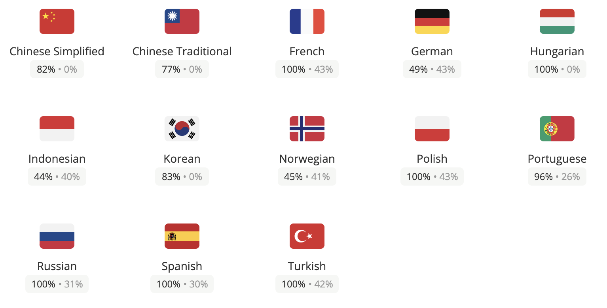

From the early days people asked us the [Excalidraw](https://excalidraw.com) to be translatable to other languages and thanks to our contributors that requst landed pretty fast.

<!-- end -->

We are using the community based translation platform [Crowdin](https://crowdin.com) and we couldn't be able to cope with the demand without it. It supports great integration with GitHub and all the PR are happening automatically, once the new translations are coming in. Pretty magical.

Every new string that needs translation is added on Crowdin for all languages. Then the translators can see the untranslated strings and translate them, while Crowdin is recommending with great suggestions for every language. Finally once the translator is happy, the translations are being copied to the app and will appear live with the next release.

Anyone can join and contribute to our translations. So go ahead and [join the project now](https://crowdin.com/project/excalidraw) if you want to help. If you want to contribute to a lanaguage that is not on the list yet, please [submit an issue](https://github.com/excalidraw/excalidraw/issues/new) with the request and we'll add it on the list.
