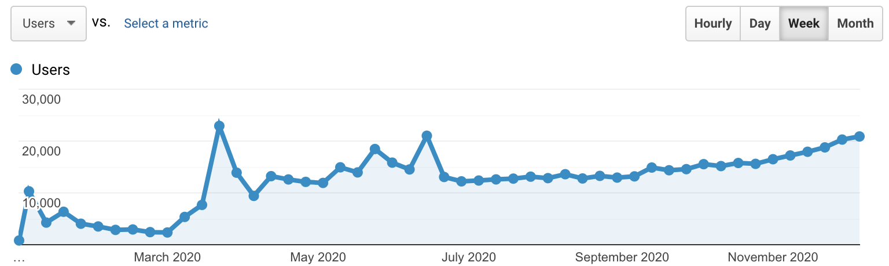

> It's been kind of a different year, but it was the first year and pretty amazing for [Excalidraw](https://excalidraw.com).

<!-- end -->

Some words from the big boss [@vjeux](https://twitter.com/vjeux)

> Bla bla bla

## Let's start with some numbers

It's been a nice and steady growth, given that our only marketing is Twitter, and of course all the love that we are receiving over there. We are reaching around **60K visits** per month and the grand total of the visits in our first year is well over **500K**!

### Visits

### Commits

We have over [100 contributors](https://github.com/excalidraw/excalidraw/graphs/contributors) that help us ship almost daily fixes, improvements, and new features right to production. Using tools and services like [Vercel](https://vercel.com/), [Dependabot](https://github.blog/2020-06-01-keep-all-your-packages-up-to-date-with-dependabot/), [Crowdin](https://crowdin.com/project/excalidraw) we can smooth this process out, or even completely automate it.

https://excalidraw.com/#json=5035223658004480,t4Y53hm-6O1PgeUVwG_GMQ

## Our basic tech stack

Excalidraw is fully open source, but it also stands on the shoulders of many other open source projects. We couldn't do it without [Rough.js](https://github.com/rough-stuff/rough), the library that gives Excalidraw its unique look, and [React](https://github.com/facebook/react), of course. [TypeScript](https://github.com/microsoft/TypeScript) is also essential to tame the complexity of our codebase, giving a helping to hand to new contributors (and old ones alike), and reducing the need to write as many tests. Our full list of [dependencies](https://github.com/excalidraw/excalidraw/network/dependencies) is listed on GitHub and we are thankful to Dependabot to keep them all up to date.

## Some of our coolest features

### 🤝 Collaboration

Collaborating with multiple users was [first implemented](https://github.com/excalidraw/excalidraw/pull/879) by [idlewinn](https://github.com/idlewinn) and improved gradually from them on. It's end to end encrypted which means that not only our servers can't read the contents, but if it ever happens to fall into someone else's hands they won't be able to read it either.

### 🔒 Your data is encrypted

The [backend](https://github.com/excalidraw/excalidraw-json) support for storing data was implemented by [lipis](https://github.com/lipis) and the client [support for encrypting](https://github.com/excalidraw/excalidraw/pull/642) the data before submitting was done by [vjeux](https://github.com/vjeux). Read more on how we are doing it in [end to end encryption](/end-to-end-encryption/) article.

### 📚 Library

The library was [first implemented](https://github.com/excalidraw/excalidraw/pull/1787) by [petehunt](https://github.com/petehunt). Later after adding support for saving the library as a file, we eventually introduced a public directory for libraries. Visit [libraries.excalidraw.com](https://libraries.excalidraw.com) for more.

### 📊 Excalicharts

While we aim to keep Excalidraw simple to use, sometimes we hide little easter eggs that you need to find out for yourself (or follow our [Twitter account](https://twitter.com/excalidraw)). For example, you can copy any two column data from Excel, Spreadsheets, or comma separated values (CSV) from a text file and paste them into Excalidraw to get a nice chart out of it. The [first implementation](https://github.com/excalidraw/excalidraw/pull/1723) was done by [petehunt](https://github.com/petehunt) and the [improvements](https://github.com/excalidraw/excalidraw/pull/2495) by [lipis](https://github.com/lipis).

### ✍️ Free Draw mode

The [free hand draw](https://github.com/excalidraw/excalidraw/pull/1570) was added by [kbariotis](https://github.com/kbariotis).

### 🇺🇳 Translations

From early on, users were asking for supporting multiple languages. The [final implementation](https://github.com/excalidraw/excalidraw/pull/638) of it was done by [vjeux](https://github.com/vjeux) and the automatic integration with our [Crowdin](https://crowdin.com/project/excalidraw) project was done by [lipis](https://github.com/lipis). UI support for right-to-left languages was [implemented](https://github.com/excalidraw/excalidraw/pull/1154) by [j-f1](https://github.com/j-f1).

### 💾 File system integration and file handling

In Excalidraw, we use the [browser-nativefs](https://github.com/GoogleChromeLabs/browser-nativefs) library to integrate with the file system of the operating system. This allows us to support a true open→edit→save workflow with proper over-saving and save-as on supporting browsers, and a fallback to downloading files and file uploads on other browsers. Read more about this feature in [tomayac](https://github.com/tomayac)'s [article](/browser-nativefs/). We also have [experimental support](https://web.dev/file-handling/#demo) for file type association, so that when you double-click an `.excalidraw` file in your file explorer, the Excalidraw PWA opens.

### ⚙️ Gatsby plugin

A plugin for Gatsby where you can very easily insert Excalidraw links and it will convert it to SVG during build time. We are actually using it in this post for our charts. Implemented by [trevorblades](https://github.com/trevorblades) & [j-f1](https://github.com/j-f1), and you can find it under [@excalidraw/gatsby-embedder-excalidraw](https://github.com/excalidraw/gatsby-embedder-excalidraw).

### 📦 npm package

One of the last things we've introduced this year was the completely rewritten npm package, available at [`@excalidraw/excalidraw`](https://www.npmjs.com/package/@excalidraw/excalidraw). Long time in the making (thanks to [@aakansha1216](https://twitter.com/aakansha1216) for most of the work), this package allows you to easily embed Excalidraw as a React component into your apps.

### 📱 Mobile mode/responsive design

Touch support and mobile-optimized layout [were](https://github.com/excalidraw/excalidraw/pull/787) [first](https://github.com/excalidraw/excalidraw/pull/788) [added](https://github.com/excalidraw/excalidraw/pull/790) by [j-f1](https://github.com/j-f1). This includes the creation of a toolbar for mobile devices that displays relevant controls while still leaving most of the screen free for viewing the drawing.
## Conclusion

Bla bla

If you have any question you can always drop by our [discussion](https://github.com/excalidraw/excalidraw/discussions) board and ask whatever you want. Don't be shy, we are all super friendly.

## Get involved

Excalidraw wouldn't be able to become such a product without all the contributors that gave us not only suggestions and reporting bugs, but actual fixes with hunderds of pull requests. Bla bla bla..
