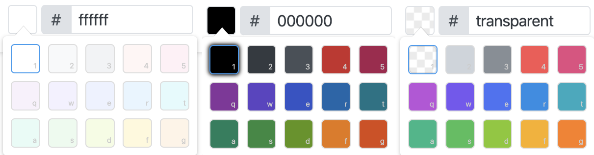

One of the qualities of Excalidraw is its simplicity. Even though we have the option to use any color of the [spectrum](https://www.google.com/search?q=%23c0ffee&hl=en), we have decided to limit our palette to a curated set of 15 colors in three different shades.

<!-- end -->

The [Open Colors](https://yeun.github.io/open-color/) color scheme has a total of 13 colors with 10 different brightnesses (0-9). For the canvas background we chose the lightest of the values (0), for the strokes the darkest one (9), and for the element background fill we went with the 6th (or the 7th, depending on how you count them).

I remember it was my very first [pull request](https://github.com/excalidraw/excalidraw/pull/378) to Excalidraw to add the **Open Colors** color scheme. I've known about this color scheme for a while now, but never found a great project to actually use it on. Excalidraw was a perfect fit.

They say a picture is worth a thousand words.  
(Click on the image below to open it in Excalidraw.)

https://excalidraw.com/#json=5120999011909632,Y57VloPaA1LSKT4-1NTgNA

Eventually we decided to install their [npm package](https://www.npmjs.com/package/open-color) so we don't have to hand-code every value. We use it both in [CSS](https://github.com/excalidraw/excalidraw/blob/master/src/css/_variables.scss), and [TypeScript](https://github.com/excalidraw/excalidraw/blob/master/src/colors.ts).

---

**P.S.** Thanks to [@heeyeun](https://twitter.com/_heeyeun) and the contributors for creating and maintaining this awesome project. Open Colors come with MIT License, which means you can use it anywhere you like without restrictions.
