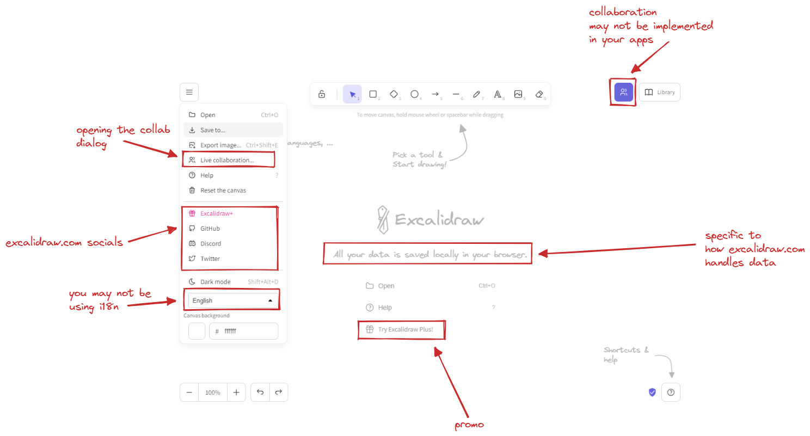
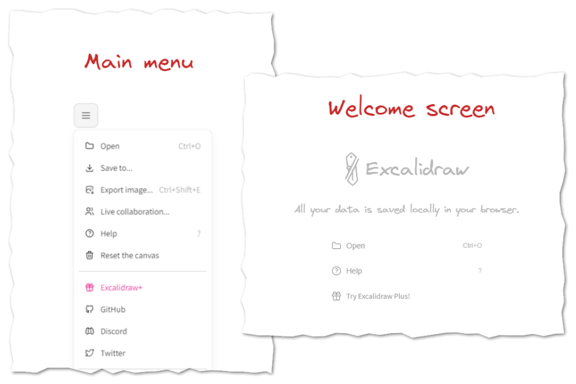
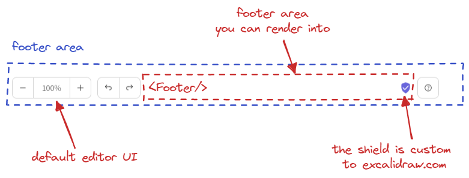
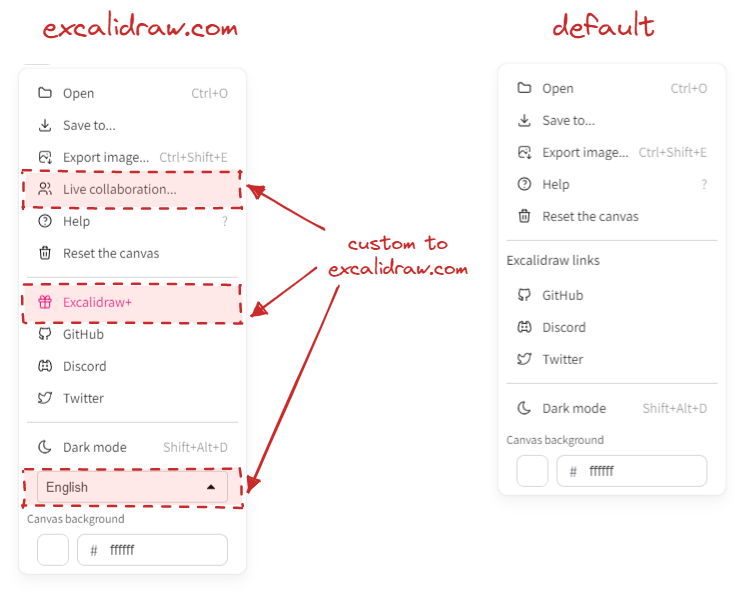
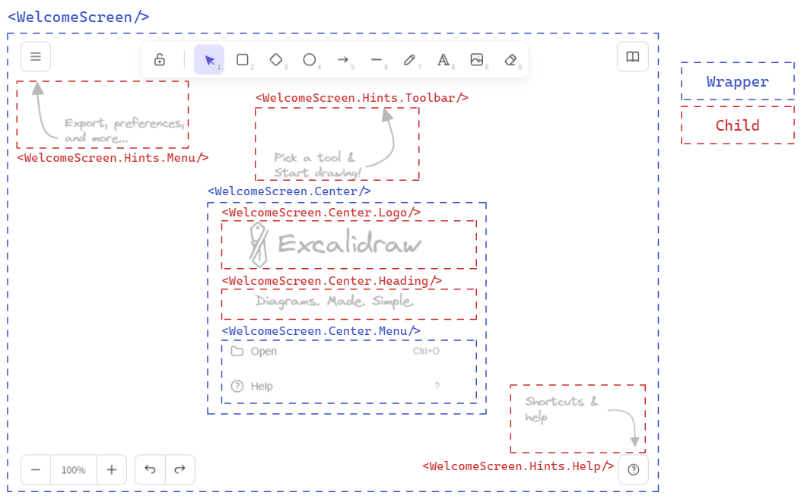

<!-- end -->

Since we've shipped the editor redesign late last year, one burning question many of you devs had was when is it going to be released to the Excalidraw package, and why has it not been released in the first place?

https://twitter.com/excalidraw/status/1587483527804854277

The reason we couldn't ship it on day one alongside the excalidraw.com release was customization. In the public app we've hardcoded some things, such as the `main menu` and the `welcome screen` — things you likely would not want hardcoded in your own apps — and we weren't quite sure how to design the API to make this easily customizable.



Today, we're releasing our initial take of what the new API will look like, allowing you to customize the major parts of what was blocking the new release. If your feedback is positive, we will continue exposing more API in similar vein so you can tailor the editor experience to your and your user's needs.

Let's take a closer look at the changes, and how or why we've implemented them that way.

---

The two new major things we've introduced as part of the redesign is the top-left dropdown that serves as the main menu, and the welcome screen, including hints for new users to help them get the gist of the UI.



It was clear from that get go that you will want to customize these to your needs, and more importantly, remove the parts that would be non-functional in your own apps.

Up to this point we've been using a combination of config objects (e.g. `props.UIOptions`), and render props (e.g. `props.renderFooter`). While these are fine and you can get most things done this way, we've set out in search of API that would be more flexible and composable, and also a bit more intuitive to use.

# Getting rid of render props

We want you to be able not only to render custom components (e.g. custom footer), but also modify the default ones. Previously we were exposing extension points through render props. Render props work fine, but were envisioning an API where you could just render everything as children of the Excalidraw component, something like this:

```jsx
import { Excalidraw, MainMenu, Footer } from '@excalidraw/excalidraw';
import { MyCustomButton } from './MyCustomButton';

export const App = () => (
  <Excalidraw>
    <MainMenu>
      {/* menu items */}
    </MainMenu>
    <Footer>
      <MyCustomButton>
    </Footer>
  </Excalidraw>
)
```

In the future, we may even expose plugins as components, so you will end up doing this:

```jsx
import { Excalidraw, MinimapPlugin } from "@excalidraw/excalidraw";

export const App = () => (
  <Excalidraw>
    <MainMenu>{/* menu items */}</MainMenu>
    <MinimapPlugin />
  </Excalidraw>
);
```

At the end of the day, it's more of an aesthetic decision rather than functional one, as we could achieve the same with render props as well. One benefit is that the API surface area is smaller. We won't export a component, and then also have a render prop for it — you just render it.

Another goal is to start decoupling the UI from the editor. We want the core to be usable without React, and as such, delineating the UI more clearly and separating it from editor configuration and logic made sense.

But, using `children` is not without tradeoffs, so let's go over some of the new API changes, explain how it works under the hood, and what are the implications for your apps.

# `<Footer/>`

Here's what the footer looks like in the editor:



We have the default footer UI, which you currently cannot change. And there's an area in the middle you can render into. Previously you'd do that using a `renderFooter` prop. Now, you'll import a `Footer` component from our package, and render it as a child of the `Excalidraw` component, alongside any UI you want.

```jsx
import { Excalidraw, Footer } from "@excalidraw/excalidraw";

const App = () => (
  <Excalidraw>
    <Footer>
      <button onClick={() => console.log("Clicked!")}>Click me</button>
    </Footer>
  </Excalidraw>
);
```

So how does this work underneath? How do we know what is a `Footer` child component, and what is an unrelated component when it comes down to rendering it to an appropriate place in the UI?

For this, we've decided to reach for an older React API, now considered [legacy](https://beta.reactjs.org/reference/react/Children): `React.Children`. But it does its job well, so something like that will not stop us from using it :).


In short, we loop through the children you pass to Excalidraw and filter the components we are looking for using their `displayName`. Here's what the simplified code looks like:

```tsx
export const getReactChildren = <
  ExpectedChildren extends {
    [k in string]?: React.ReactNode;
  }
>(
  children: React.ReactNode,
) => {
  return React.Children.toArray(children).reduce(
    (acc: Partial<ExpectedChildren>, child) => {
      if (React.isValidElement(child)) {
        acc[child.type.displayName] = child;
      }
      return acc;
    },
    {},
  );
};
```

In practice we also validate against expected children names, and render the rest as is.

This is great as it allows you to render all the UI components as children, irrespective of the order, and we can pick and choose where to render what.

But it also has some downsides.

For one, you have to render the components as top-level children of the `Excalidraw` component. This is not a big deal, but it does mean that you can't render the `Footer` component as a child of another component, or we wouldn't be able to find it:

```jsx
const MyFooter = () => {
  return <Footer />;
};

const App = () => (
  <Excalidraw>
    {/* nope :( */}
    <MyFooter />
  </Excalidraw>
);
```

Let's move on to the next component.

# `<MainMenu/>`

The top-left dropdown menu was introduced in the new editor design, and we wanted you to be able to customize it to your needs.

Below is what the menu looks like on excalidraw.com (left), vs what we render by default in the package (right).



But, we've opted for maximum flexibility. If the default items do not suit you, you can render the `MainMenu` component yourself, and we'll let you build it up from scratch — using the default menu item components, or your own.

```jsx
import { Excalidraw, MainMenu } from "@excalidraw/excalidraw";

const App = () => (
  return (
    <Excalidraw>
      <MainMenu>
        <MainMenu.DefaultItems.LoadScene />
        <MainMenu.DefaultItems.Export />
        <MainMenu.DefaultItems.SaveAsImage />
        <MainMenu.Separator />
        <MainMenu.Item onSelect={() => alert("Hello to you too!")}>
          Hello!
        </MainMenu.Item>
      </MainMenu>
    </Excalidraw>
  );
);
```

As with `Footer`, you'll need to make sure it's the top-level child of the `Excalidraw` component.

# `<WelcomeScreen/>`

Another thing we've introduced in the redesign is the welcome screen. This one is a slightly more complicated beast, as it is composed of several separate elements, each rendered in different parts of the UI.

The two main components is the center part containing the logo and quick actions, and the hints pointing out what users can find in the UI.



You can again customize most of everything. If you want to render just the center, be our guest! If you want to change the hints a bit, you can do so as well.

One caveat is that we require not just the `<WelcomeScreen>` to be a top-level child, but also the `<WelcomeScreen.Center/>` and `<WelcomeScreen.Hints/>` to be the direct children of the `<WelcomeScreen>`.

```jsx
import { Excalidraw, WelcomeScreen } from "@excalidraw/excalidraw";

const App = () => (
  return (
    <Excalidraw>
      <WelcomeScreen>
        <WelcomeScreen.Hints.ToolbarHint />
        <WelcomeScreen.Center>
          <WelcomeScreen.Center.Logo />
          <WelcomeScreen.Center.Heading>
            You can draw anything you want!
          </WelcomeScreen.Center.Heading>
          <WelcomeScreen.Center.Menu>
            <WelcomeScreen.Center.MenuItemHelp />
            <WelcomeScreen.Center.MenuItemLiveCollaborationTrigger
              onSelect={() => setCollabDialogShown(true)}
            />
            {!isExcalidrawPlusSignedUser && (
              <WelcomeScreen.Center.MenuItem
                onSelect={() => console.log("doing something!")}
              >
                Do something
              </WelcomeScreen.Center.MenuItem>
            )}
          </WelcomeScreen.Center.Menu>
        </WelcomeScreen.Center>
      </WelcomeScreen>
    </Excalidraw>
  );
);
```

# Wrapping up

So that's it. Let us know how you like the new API, and what you think about the direction we're taking it in. While there are still some rough edges about the way we do it now, and there are some implications we will cover later, we're excited to see what you'll be able to build with it. We'll be closely listening to your feedback, so let us know in the [Discord](http://discord.gg/UexuTaE) or on [GitHub](https://github.com/excalidraw/excalidraw/discussions)!

For now, you can read more on the newly introduced API in our [readme docs](https://github.com/excalidraw/excalidraw/blob/master/src/packages/excalidraw/README.md#component-api). But, we are working on much improved docs as we speak which we'll be releasing soon, alongside more detailed examples on the above API and how to handle specific cases. Stay tuned! 💜

In the meantime, you can also let us know what you'd like us to cover!

https://twitter.com/excalidraw/status/1613207731799834625
