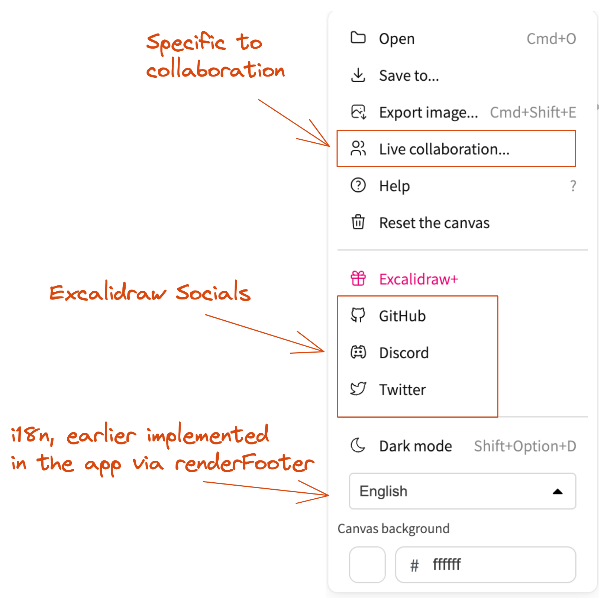

<!-- end -->

Since we've shipped the editor redesign late last year, one burning question many of you devs had was when is it going to be released to the Excalidraw package, and why has it not been released in the first place?

https://twitter.com/excalidraw/status/1587483527804854277

The reason we couldn't ship it on day one alongside the excalidraw.com release was customization. In the public app we've hardcoded some things, such as the `main menu` and the `welcome screen` — things you likely would not want hardcoded in your own apps — and we weren't quite sure how to design the API to make this easily customizable.


Today, we're releasing our initial take of what the new API will look like, allowing you to customize the major parts of what was blocking the new release. If your feedback is positive, we will continue exposing more API in similar vein so you can tailor the editor experience to your and your user's needs.

Let's take a closer look at the changes, and how or why we've implemented them that way.

---

The two new major things we've introduced as part of the redesign is the top-left dropdown that serves as the main menu, and the welcome screen, including hints for new users to help them get the gist of the UI.


It was clear from that get go that you will want to customize these to your needs, and more importantly, remove the parts that would be non-functional in your own apps.

Up to this point we've been using a combination of config objects (e.g. `props.UIOptions`), and render functions (e.g. `props.renderFooter`). While these are fine and you can get most things done this way, we've set out in search of API that would be more flexible and composable, and also a bit more intuitive to use.

<!-- TODO -->

# Main idea and implementation

Our current api is heavily dependent on `render` props and its not easy to customize the UI apart from just specific parts eg `renderTopRightUI`, `renderFooter` where we provide the `render` props so host can update it as needed.

Our intention is to make the API heavily customizable and in the `React` way. Hence we want to slowly move to `Component` API where host will be able to pass the individual parts of the UI as `React` Children and Excalidraw will take care of rendering it correctly and with this we will be removing the `render` prop as well.

As mentioned earlier about the new editor redesign due to which we decided redesign the API as well, [these](https://github.com/excalidraw/excalidraw/issues/5960) were mainly the blockers for the release.

So lets do a quick div in to the new Component API :)

# `<Footer/>`

[Add an image for footer]

This was the first [POC](https://github.com/excalidraw/excalidraw/pull/5970) to try out the component API. We earlier supported `renderFooter` prop and now that prop is removed. So host will have to import `Footer` component and pass it as `children` if they want to customize.

## Before

```jsx
import { Excalidraw } from '@excalidraw/excalidraw'
const App = () => (

  <Excalidraw renderFooter = {(isMobile, appState) => {
		if (isMobile) {
				return null;
		}
		return (
		<button
			className="custom-footer"
			onClick={() => alert("This is dummy footer")}
		>
			{" "}
			custom footer
		</button>)
	}}>
)
```

## Now

```jsx
import { Excalidraw, Footer } from "@excalidraw/excalidraw";

const App = () => (
  <Excalidraw>
    <Footer>
      <button
        className="custom-footer"
        onClick={() => alert("This is dummy footer")}
      >
        {" "}
        custom footer
      </button>
    </Footer>
  </Excalidraw>
);
```

As you can see now you can customize the footer by passing it as a child in your Excalidraw component.

With the redesign the `footer` was moved inside the dropdown in mobile to save more space. So you will need to customize the [MainMenu](#MainMenu) which we will discuss next.

# `<MainMenu/>`

The top left menu was introduced in the editor redesign so we want to allow users to customize the items the `MainMenu`and also reuse the default items present in Excalidraw menu if needed thus giving maximum flexibilty to the host.



In the above diagram The `Live Collaboration` dialog is specific to host, so you will want to render if your app supports collaboration else not.

Similarly under socials section you might want to render your own social account along with Excalidraw Socials.

As per internationalization, if your app supports i18n you will have your app level support to change the language and hence the language dropdown was never the part of the package as its specific to excalidraw app and you can pass the `langCode` to decide which language to use in Excalidraw. Though we later might export the `LanguagePicker` component as well.

In the excalidraw app as it was supported using `renderFooter` prop. Now since its part of `menu` so here also its one of the items which host would want to render.

To summarize we have these cases to cover

1. Render the dropdown with default items so if host don't want to customize they will get the menu with default items.
2. Allow host to selectively render some of the default items, eg if you only want to render `Reset the canvas` item.
3. Allow host to render their own custom items with excalidraw style eg "Excalidraw+".
4. Allow host to render their own custom items with their own style eg "Language picker".
5. Allow host to group items.
6. Lastly also make sure `UIOptions.canvasActions` are taken into consideration when rendering the default menu items for backward compatibility.

[ add a diagram explaining the API how the above was solved]

# `<WelcomeScreen/>`

TODO
