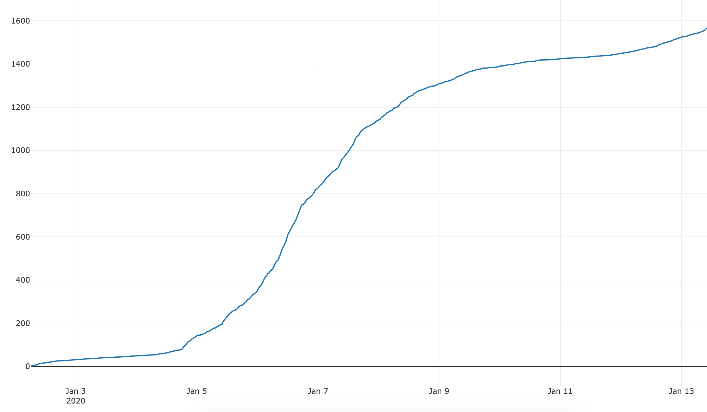

On January 1st I started building a little tool that lets you create diagrams that look like they are hand-written. That whole project exploded and in two weeks it got 12k unique active users, 1.5k stars on GitHub and 26 contributors on GitHub (who produced real code, we don't have any docs). If you want to play with it, go to [excalidraw.com](https://excalidraw.com/).

Many people have asked me how I got so many people to contribute in such a short amount of time for Excalidraw, while this is still fresh in my mind, let me post about what I was thinking about during the process.

## S Curve

Before we get started with the actual content, here's an interesting concept that was in my mind thorough the project. I discovered the concept of a [S curve through Kent Beck's video series](https://www.facebook.com/KentBeckProgrammer/videos/947793608667282/). There are three rough phases:

- the first phase is when you do R&D and develop the product, there's a lot of work done but no real visible impact
- the second phase is the exponential part where everything is growing tremendously
- the third phase is when the growth flattens and you're doing smaller improvements (which can still be huge if the baseline is huge)

The S curve is usually used to describe bigger projects but it turns out Excalidraw just went through a S curve as seen in this chart that plots the number of stars over the past two weeks.

The most important part for me was to capitalize on the growth phase so that the project doesn't die when it hits the stabilization phase.
