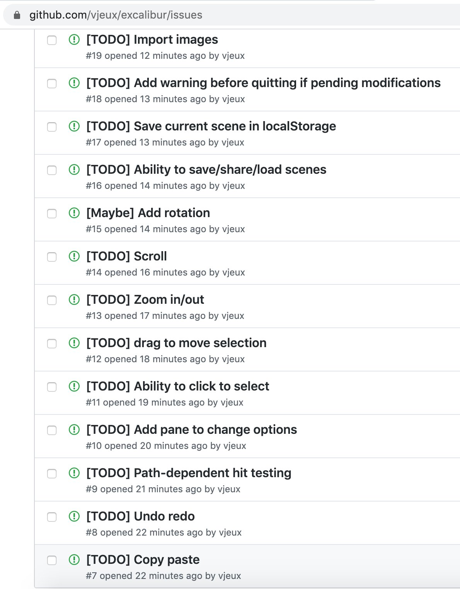

On January 1st I started building a little tool that lets you create diagrams that look like they are hand-written. That whole project exploded and in two weeks it got 12k unique active users, 1.5k stars on GitHub and 26 contributors on GitHub (who produced real code, we don't have any docs). If you want to play with it, go to [excalidraw.com](https://excalidraw.com/).

<!-- end -->

Many people have asked me how I got so many people to contribute in such a short amount of time for Excalidraw, while this is still fresh in my mind, let me post about what I was thinking about during the process.

## S Curve

Before we get started with the actual content, here's an interesting concept that was in my mind thorough the project. I discovered the concept of a [S curve through Kent Beck's video series](https://www.facebook.com/KentBeckProgrammer/videos/947793608667282/). There are three rough phases:

- the first phase is when you do R&D and develop the product, there's a lot of work done but no real visible impact
- the second phase is the exponential part where everything is growing tremendously
- the third phase is when the growth flattens and you're doing smaller improvements (which can still be huge if the baseline is huge)

The S curve is usually used to describe bigger projects but it turns out Excalidraw just went through a S curve as seen in this chart that plots the number of stars over the past two weeks.

The most important part for me was to capitalize on the growth phase so that the project doesn't die when it hits the stabilization phase.

## Proven Value Proposition

Excalidraw didn't come out of nowhere, I've been using a tool called [Zwibbler](https://zwibbler.com/demo/) for probably 10 years in order to build hand-drawn like diagrams to illustrate my blog posts. I've always had this feeling that this tool was underrated. I seemingly was the only one to use it even though it felt like it could be used much more broadly.

So when excalidraw came out, there was a clear value proposition and I knew it was going to be somewhat successful. Those days I don't have that much free time so I tend to spend my time on things that I believe have a high likelihood of being successful, especially side projects.

## Make Some Noise

The first thing was to get people excited! I'm fortunate to have a sizable audience on Twitter so I used it by posting a bunch of videos of the progress of building the first version of the tool.

https://twitter.com/Vjeux/status/1212503324982792193

## Convert Attention to Action

I got more attention than I anticipated so I felt like I could convert it into actual action. For this, the best way I've found is to create a bunch of issues about all the things that need to be done. I've been thinking about rebuilding a Zwibbler equivalent for a long time so I had a pretty good sense of what needed to be done.

People that wanted to contribute could just skim through the list of things to be done and start hacking. That worked really well!

## Who is Contributing?

When I open sourced React Native, I was convinced that the same people that contributed to React would contribute to React Native. It turns out I was plain wrong, a new set of people started contributing. This same pattern applied to all the subsequent projects I've worked on since then.

This is a very broad generalization but most people that tend to contribute significantly to early projects like this are unknown (if they were well known, they'd likely have better opportunities to spend their time) but experienced (they are able to jump in on a random codebase and contribute).

## Keeping People Engaged

The name of the game is to get as much from people that are interested in contributing as possible. Your initial buzz is only going to last so long (a few days), so you want to capitalize on that time. Everyone (myself included) is likely going to have to go back to their real job soon.

For this, I usually try to be very responsive on the pull requests coming in. If you can get turnaround in less than 10 minutes, then you can have real-time work and people will stay engaged as long as you are.

I've tried something new this time and gave commit access to everyone that got a PR merged in. In the past I would do it after I've seen sustained work. This worked really well where this gave an extra motivation for people to contribute and they also started to review each other's code which was awesome! I am not worried about people abusing their power, people that spend energy getting something of quality in tend to be considerate.

A trick I've been also using is to merge pull requests even if they're not exactly the way I want and then push all the follow ups I had in mind. This way the person can have their feature shipped and likely to come back without having expensive back and forth (we never know when / if they're going to apply suggestions).

## Be Decisive

People are going to try and stir the project in all sorts of directions with their ideas and pull requests. It's pretty tricky to think in advance what kind of suggestions you're going to get because people tend to get very creative (in both good and bad ways...).

If you want something to happen, you need to give a very clear "yes" with concrete things that need to be done. If you're not sure or change your mind multiple times or answer days/weeks later, people are either not going to invest their time making it happen, or will lose interest and not push it to conclusion.

On the flip side, you're likely going to see a lot of pull requests or suggestions that you don't think are a good idea. I've found that it's usually not a good idea to give a clear "no" as it's a hard message to give to a stranger over text. Instead, what I found tends to work better is to space out replies and ask for more information. The other party will naturally lose interest and move on. You should use this technique very sparingly as it is not a nice approach.

## Keeper of Quality

With so many simultaneous contributions, the product can easily start losing quality. I view myself as the keeper of quality. I've been pretty obsessed about all the small details and things that feel off.

Every time I see a problem, I open an issue with a small repro case. In many cases, those issues are easy to fix and someone will get to it. I also make sure to clear the backlog so that we're always in a good enough shape.

I've also made sure that some core values were being maintained. I want minimal friction to get started drawing. In particular, this means that what you see first should be the shapes. I had to actively prevent people from adding title selection and login to keep this property.

## Celebrate Success

Posting about all the good things that happen, be it a new cool feature, or interesting usage or thoughts in the topic will increase the size of that channel as those posts will attracts an audience.

The other interesting thing that will happen is that you will provide an audience to a lot of the people that are contributing. As I mentioned earlier, they're unlikely going to have a big one of their own that cares about this topic.

This is a win-win situation! It takes time to actually post all those things but I've seen it being valuable time and time again.

## Empty Canvas

What I found fascinating with this project is that many people were able to project their dreams and ideas onto it. I've been told that I should quit my job by at least three people and build a startup around this project as they saw a lot of growth potential in different areas. (Sorry, I'm not, but if you want to, the business is up for grab!)

I'm not exactly sure what to make of that but it led to great conversations! That's more than I hoped for with this project.

## Things That Went My Way

I wish anyone could read this and reproduce it but that's not completely true. I had a lot of things that went my way. I found it to be useful to know what advantages people behind success stories have to see how they affect their abilities to deliver.

- I have more than 10 years of experience building front-end and it turns out that I learned very little on the technical front during this project. I've done all the pieces many times one way or another. So when it was time to architect the project, split up the work, review code or suggestions, do the work, manage contributors, evangelize... All of this was pretty much mechanical and didn't require much thinking. This helped speed up everything so that a lot more than usual would fit within one buzz cycle.
- I have a large audience on Twitter and I've worked closely in the past with other people with large audiences (hi Dan Abramov and Jordan Walke!) who were willing to evangelize the project. Without that, I wouldn't have been able to get the project in front of so many people so quickly.
- Excalidraw was built with other projects such as CodeSandbox, Zeit, Rough. They've been fantastic to use and were part of the reason why the project got off the ground so quickly. I encountered some small issues with those dependencies, which likely would have ended up somewhere on an issue tracker and eventually got fixed. But because I personally knew the owners of the first two projects and was visible enough for the third, I was able to get those issues resolved extremely quickly, which is not everyone's experience.

## Conclusion

This was a fun project to work on while procrastinating on writing performance reviews. I'm not exactly sure what the future holds for Excalidraw but I'm happy that it is now at a point where I can finally use it to illustrate the blog post I wanted to write that started this whole project (hello rabbit hole!).

Now, go draw some things with [excalidraw.com](https://excalidraw.com) and if you see something you'd like improved, please contribute on GitHub! [github.com/excalidraw/excalidraw](https://github.com/excalidraw/excalidraw)
