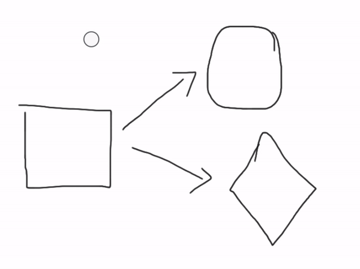
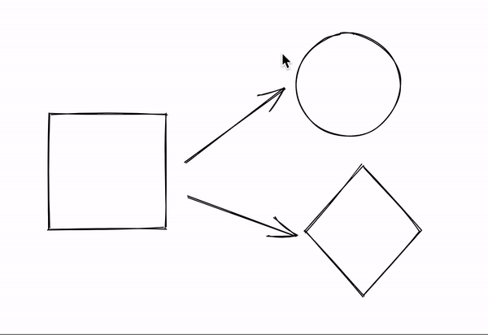
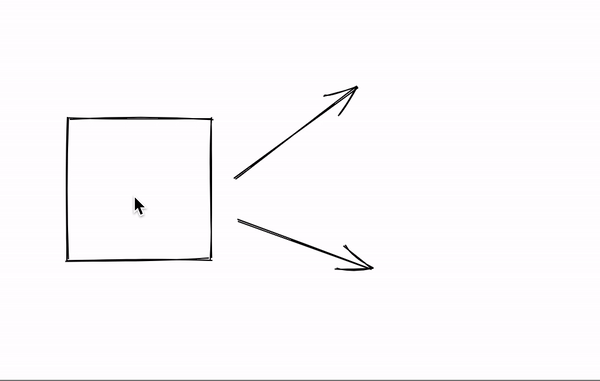
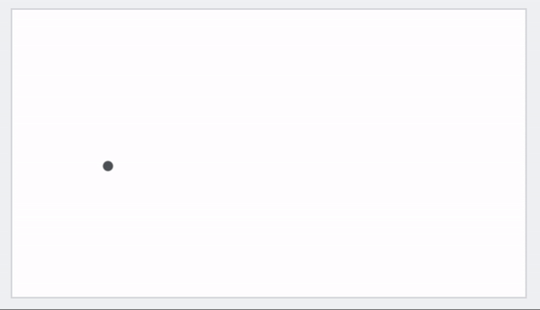

[Excalidraw](https://www.excalidraw.com/) started as a virtual tool to draw diagrams but a lot of people started using it to replace physical whiteboards. In this post we'll walk through many aspects of physical whiteboards that do not make sense to translate as is in the virtual world.

<!-- end -->

## Predefined Shapes

Hand-free drawing with a mouse or trackpad is hard! For example, here is me trying to write the word "whiteboard". It took me 25 seconds and the result looks okay at best.

Writing text is such a common operation that keyboards have been developed for this use case. With Excalidraw I can just type the letters and have it written in less than 3 seconds.

Fortunately, most whiteboard applications let you write text using the keyboard, but for some reason they don't apply the same concept with common shapes you're drawing when using a whiteboard.

Speed wasn't that much an issue here but look at this circle... And it's not for lack of trying, I took a few takes and this is the best circle I managed to draw.

Because those shapes are so commonly drawn, Excalidraw provides them by default. Here's the same diagram drawn with Excalidraw:

## Modifications

I'm not happy with the way that previous circle looked like and want to redo it. In a physical whiteboard I first need to erase the current one. This is again an operation that's very painful (Aaarrrghhh!!) when directly ported from the physical world.

Excalidraw lets you select the shapes you've previously drawn and use backspace key to get rid of them.

Once you move to the virtual world, you can do operations like resizing, moving, copy pasting shapes. Those operations are not possible in the real world.

## Infinite Canvas

Another constraint of the physical world is that the whiteboard has a fixed size. It is shaped by a lot of physical factors like the size of the room / wall, at a height so that it's comfortable for a standing human to draw...

Have you ever been in a situation where you end up at the bottom of the whiteboard but your diagram is not complete and you end up drawing the rest somewhere else completely unrelated?

If we remove this physical limitation, I can just scroll a bit and continue the drawing.

A nice benefit of having a virtual canvas is that if you want to draw something else, you can just scroll to a place that's empty and start drawing. You don't need to take an explicit step of saving the current file, creating a new empty file, figuring out what to name it...

## Conclusion

If you need a replacement for a physical whiteboard as you are working from home, [Excalidraw](https://www.excalidraw.com/) may be a good solution for you! Using the live collaboration feature and [end to end encryption](/end-to-end-encryption/), we've seen people successfully use Excalidraw for brainstorming sessions, architecture interviews or even drawing org charts to prepare for re-orgs...

If you are building or evaluating physical whiteboard replacements, think about what physical limitations do not make sense anymore in the virtual world and what are the various ways to adapt it.
