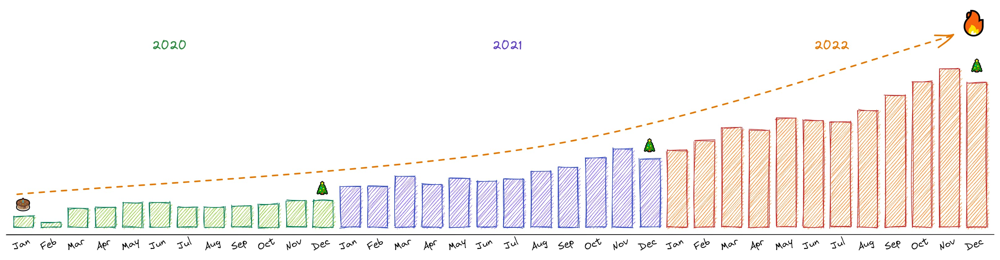
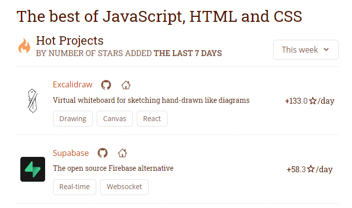

It's been a great year for Excalidraw, and we're excited to share what we've been up to!

<!-- end -->

Greetings Excalidraw users! Thank you all for the support throughout the year, and for being a part of our growing user base! ❤️

With your help, we've recently crossed **350K monthly users**. 🔥 On top of that, we’ve counted [**38K stars on GitHub**](https://github.com/excalidraw/excalidraw) just before the end of the year, and are constantly trending everywhere, such as on the [bestofjs.org](https://bestofjs.org) project repository — this helps the open-source part of Excalidraw get in front of more developers like you!

Let's have a look at what we and you have been up to the past year!

(Psst, if you don't get to the end of the post, and you're looking for work, [we're hiring](https://excalidraw.slite.com/app/docs/kqzVFHykBHg-we/Join-the-Excalidraw-team)! 🚀)

# What we’ve shipped in the editor

One of the biggest changes we've been proud to unveil last year was undoubtedly the editor redesign. While having scores of people contribute to the editor is awesome (much love!), if not careful, over the years you can end up with a design without a strong single thread going through!

This is where [Tony Bures](https://twitter.com/mrkvi) came in with a new design, and enlisting the help of [Barnabás Molnár](https://twitter.com/_barnabasmolnar) we were able to ship the new interface that still keeps out of your way, is even a bit more compact, a little more consistent, and even makes room for new features we'll be shipping this year!

There are some rough edges we need to fix up, such as missing hover/active states here and there, and some components still need porting (looking at you, context menu!). And not to forget, mobile design — while it's sporting the new drip, it will need a bit more work to truly shine and make you effective on your small devices!

https://twitter.com/excalidraw/status/1587483527804854277

### What may have you missed in 2022?

If you're using Excalidraw regularly, you shouldn't have missed many new features. But some can be a bit hidden, so let's take a look at some of the prominent changes this year. (We've included nuggets of information you may like 👀).

---

Freedrawing is fun, but sometimes it can get annoying if drawing gets slow, or unwanted gestures start happening, especially when using a stylus.

Palm rejection is hard in general, but doubly so on the web, so instead of doing that, we decided to sidestep it for now, and [Zsolt Viczián](https://twitter.com/zsviczian) helped us ship pen mode instead. It's enabled when we first detect a pen (stylus), and we start preventing most touch events until you leave it. You can still pan the canvas with two fingers, but we've learned that your hand triggered zooming too often so we've disabled touch-zooming in pen mode, too.

In the future we'll want to investigate better palm rejection so that if nothing else, we can re-enable touch-zooming.

https://twitter.com/zsviczian/status/1488879818305384449

Other common problem on tablets was performance. Some pens were firing pointer events much more frequently than needed, causing a bottleneck in rendering. So we've throttled them to not exceed the framerate of your screen (commonly 60Hz), which had the desired effect.

https://twitter.com/excalidraw/status/1491044664731856900

While performance improved, it may technically result in slightly less line resolution — for most use cases it's perfectly fine, but for handwriting we may want to investigate other venues (on that note, we would need to modify the freedraw algorithm, and there's also the fact that most devices don't emit high-resolution pointer events in the first place).

We've also heavily improved the Apple Pencil Scribble getting in the way, often dropping draw gestures altogether. Even so, sometimes drawing on iPads still triggers character recognition, which it's unclear whether we can prevent — if you're facing these problems, you might consider disabling Scribble in your settings.

Mobile and tablet experience is an ongoing effort and there are many more improvements to be had! But, you’re already making art in Excalidraw, so that makes us happy! ❤️

https://twitter.com/Biernacki/status/1584990065729888256

Do you know we support hyperlinks in the editor? Added by [Aakansha Doshi](https://twitter.com/aakansha1216), it allows you to add clickable links to elements to adding additional information and resources. Especially useful for linking diagrams together (e.g. on Excalidraw Plus 😋).

Support for in-diagram linking coming this year!

https://twitter.com/aakansha1216/status/1489256535817854977

One missing feature was to add background to freedraw shapes, which was correct by [Arun](https://twitter.com/node_monk)!

https://twitter.com/excalidraw/status/1491456843742605313

Until we do a proper redesign of the color picker, a useful feature we've added last year is to pick from the custom colors you've been already using on your canvas.

You'll be able to pick from more shades and better colors in the upcoming color picker. 🎨

https://twitter.com/aakansha1216/status/1498292311381655554

Now having a prominent position in the toolbar, previously you may have missed we've also added the Eraser tool, which allows you to remove multiple elements with way more ease, especially those tiny freedraw lines!

https://twitter.com/aakansha1216/status/1502296876405891074

[Tom Sherman](https://twitter.com/tomus_sherman) added element locking to the editor, allowing you to lock elements in place to prevent accidental modifications or deletions.

It's hidden under the context menu because the only way to unlock elements at the moment is by right-clicking and unlocking them from the context menu again. Thus, we haven't put the lock button elsewhere in the UI so you don't lock elements unintentionally as you explore what each button does, and not knowing how to unlock them.

https://twitter.com/excalidraw/status/1512104367213658122

Libraries is something we'll be spending way more time on this year, but a big change led by [Ishtiaq](https://twitter.com/ishtiaq103) last year was moving libraries to a sidebar, allowing you to keep the libary open at all times:

https://twitter.com/excalidraw/status/1539269812253335553

And little known feature is the ability to add multiple libraries to your canvas at once:

https://twitter.com/excalidraw/status/1524423937542795265

You could add new points to existing arrow/lines in the line editor (<kbd>Ctrl/Cmd-Enter</kbd>) before, but it was hard to add points in the middle segments, so we've decided to work on that.

First, Aakansha added support for adding a midpoint to lines outside the line editor:

https://twitter.com/aakansha1216/status/1557748574712041473

And then also allowed adding midpoints to any segment from within the line editor. We've decided to not expose this outside the line editor for now because it tends to get in the way too often when you try to move lines around.

https://twitter.com/excalidraw/status/1570059398881636354

[Ryan](https://twitter.com/_ryan_di) and [David](https://twitter.com/dluzar) have improved the default radius sizing for rectangles, making rectangles rounding to look similar across different sizes. While in the future we may support customizing radius to a point, our goal still is to make diagramming easy with as little tinkering with the settings as possible.

https://twitter.com/excalidraw/status/1600883623980171265

Towards the end of the year, Aakansha added the long awaited ability to add text labels to arrows!

https://twitter.com/excalidraw/status/1599792132725669888

But, Excalidraw is also about the community helping out! Here, [Alex Kim](https://github.com/alex-kim-dev) fixed a vexing issue when resizing certain elements.

https://twitter.com/excalidraw/status/1559205594782990345

Want to help make Excalidraw better yourself? We'll soon be making it easier to make your first contribution, so stay tuned, but you can head over to our [GitHub](https://github.com/excalidraw/excalidraw) right now.

# What's happening on the Plus side?

If you don't know, last year we've unveiled [Excalidraw Plus](https://plus.excalidraw.com/), an app aimed at teams built on top of the Excalidraw editor, offering companies much needed authorization and team management, and everyone a secure environment to organize their drawings, while still keeping our focus on simplicity and low friction. Adoption is not slowing down, and the app development is not lagging behind!

We have big plans this year you will certainly appreciate, but let's give a shout-out to a few things that happened in Plus last year.

---

We're iterating on the design not just in the editor, but in the Plus app, too! Besides the new look, we've added a search panel you can invoke anywhere:

https://twitter.com/excalidraw/status/1529106689600921600

An important addition was the introduction of the Dashboard. Get around quickly and view who's drawing right now, and where.

https://twitter.com/excalidrawPlus/status/1540091685874634754

As the Plus app lives on a different subdomain, some of you were wishing for a more streamlined access. [Milos](https://twitter.com/milosvete) added support for automatically redirecting you to Plus when you're signed in, so you can access it directly from [excalidraw.com](https://excalidraw.com).

We're considering to make this the default (you would be always able to opt-out), because it can be confusing for some still. Let us know your thoughts on this one!

https://twitter.com/excalidrawPlus/status/1526973455475671040

On that note, we've also made it possible to choose what page will be loaded first. You can pick between the editor or the dashboard, and more. What other shortcuts should we add?

https://twitter.com/excalidraw/status/1559936348508884994

To reduce friction further, you can now create drawings even quicker. Use the "start drawing" button in the Dashboard, or <kbd>Opt/Alt + A</kbd> everywhere else.

https://twitter.com/excalidraw/status/1571886450903220232

Next, we've added support for sorting your collections, and choosing the sort order of your drawings.

https://twitter.com/excalidraw/status/1508847388517089292

https://twitter.com/excalidrawPlus/status/1549790547606388736

To please the accountants, we've added yearly billing (it's cheaper, too).

https://twitter.com/excalidraw/status/1545109954616508416

Commenting is easier in Plus now, too!

https://twitter.com/excalidrawPlus/status/1552670831402225664

# VS Code extension & GitHub

Another major thing happening in the Excalidraw ecosystem was the release of the [Excalidraw VS Code extension](https://marketplace.visualstudio.com/items?itemName=pomdtr.excalidraw-editor), maintained by [Achille Lacoin](https://twitter.com/pomdtrr?ref_src=twsrc%5Etfw). 💜

If neither the [excalidraw.com](https://excalidrwa.com) app, nor the [Plus app](https://plus.excalidraw.com) suits your needs, perhaps editing Excalidraw files from your VS Code workspace will. And you can use the extension on [vscode.dev](https://vscode.dev/) & [github.dev](https://github.dev/), too – try it out!

https://twitter.com/excalidraw/status/1511332566216884237

And you'll be able to use Excalidraw in the upcoming [GitHub Blocks](https://blocks.githubnext.com/):

https://twitter.com/excalidraw/status/1590828212615102464

# Community

## Discord

We restructured the Excalidraw Discord server to encourage engagement and interaction within our community!

If you have questions, feedback, or just want to chat, join us on [Discord](https://discord.gg/UexuTaE)! We have some surprises in the works for Discord next year! 😉

## In the wild

Excalidraw is being used far and wide.

From company docs...

https://twitter.com/willmcgugan/status/1584174595023609857

To illustrating whole books!

https://twitter.com/Pragmatic_Eng/status/1575167020139970562

Or making awesome illustrations in general:

https://twitter.com/jamesspurin/status/1605154429170229249

https://twitter.com/victor_bigfield/status/1608796818225127424

At conferences...

https://twitter.com/erikras/status/1522342340664303616

https://twitter.com/excalidraw/status/1573305116333338626

Look, he's our Aakansha! ❤️

https://twitter.com/aakansha1216/status/1555559465508040705

Those slides must have taken a lot of work! (Or maybe not, with Excalidraw 😋).

https://twitter.com/FUSAKLA/status/1538248868885893120

And not to forget [Chris's](https://twitter.com/Vjeux) talk at Next.js Conf!

https://twitter.com/Vjeux/status/1586062861662507008

Excalidraw is also getting big on Twitch and YouTube, from [@t3dotgg](https://www.youtube.com/@t3dotgg) to [@d0nutptr](https://www.twitch.tv/d0nutptr), [melkeydev](https://www.twitch.tv/melkeydev), [@devagr](https://www.youtube.com/@devagr), among [others](https://twitter.com/excalidraw/status/1596176397411971072)!

Speaking of YouTube, Aakansha recently explained how to build your own Excalidraw over at [Chirag's channel](https://www.youtube.com/watch?v=1lNJVDfsTSo).

You rock hard at Excalidraw! 🍉

# Coming up

## Excalidraw

Last year we've added many great features, but we are not done! And we want to improve on existing ones, too, such as as better text editing support, arrow binding, and more. At the same time, making sure the editor retains its simplicity and low friction.

We'll also be focusing on performance so that even huge drawings can be edited smoothly.

And we're not forgetting [libraries](https://libraries.excalidraw.com). More on that soon!

## Package

Next year, we will taking the [Excalidraw package](https://www.npmjs.com/package/@excalidraw/excalidraw) to the next level, beginning with the upcoming npm release bringing the redesigned editor to your apps, and featuring an improved API to customize some parts of the editor UI. We'll use this as a test bed on whether this type of new API works well, and we'll be making changes to the rest of the editor to allow for much greater customization.

There are lots of places in need of much smoother experience, such as the images API, listening on changes, and programmatic API in general, so we'll be working on that, too.

## Plus

For [Plus](https://plus.excalidraw.com), we'll be making strides on three fronts. Features, friction, and management.

We've learned from your feedback, and are adding features that you will like. From better sharing and readonly links integration, to presenting from Excalidraw a breeze.

At the same time, we want to ensure the app is as frictionless as possible. Getting your ideas on the canvas is what Excalidraw is about.

And we want to make it easier for business to make the transition. From user provisioning and auth (think SAML and SCIM), to billing, and enterprise support.

# Join the Excalidraw team!

As alluded at the top, we are looking for talented devs such as you! If you're as pumped about building Excalidraw as we are, we have open positions at both the Excalidraw editor and Excalidraw Plus. Check the [details](https://excalidraw.slite.com/app/docs/kqzVFHykBHg-we/Join-the-Excalidraw-team) and drop us an [email](mailto:careers@excalidraw.com)! 💪

---

It's going to be a packed year for Excalidraw across the board!

Happy New Year everyone! 🎉

Excalidraw Team
